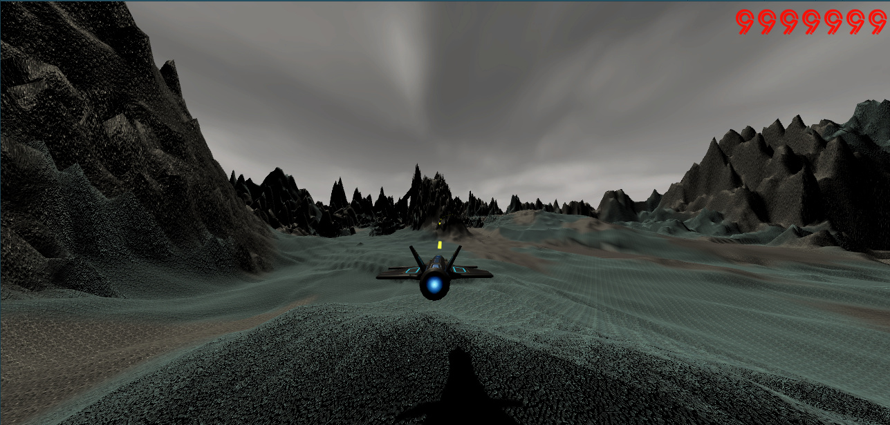

# Argon Assault

A 3D on-rails space shooter built in Unity. Pilot your spacecraft through stunning environments while battling enemy forces.

## Overview

Argon Assault is an action-packed rail shooter where players navigate a spacecraft along a predetermined path while engaging enemy targets. Features dynamic terrain, particle effects, and immersive sci-fi environments.

## Features

- **On-Rails Flight Mechanics** - Smooth arcade-style movement
- **Combat System** - Weapon firing, projectile physics, enemy AI
- **Stunning Environments** - Custom terrain with Fantasy Skybox
- **Visual Effects** - Particle systems for weapons and explosions
- **Audio Design** - Sound effects and ambient music

## How To Run

1. Open the project in Unity 2019.4 or later
2. Navigate to `Assets > Scenes`
3. Open the main scene
4. Press Play

## Technologies

- **Unity Engine 2019.4** - Game development platform
- **C#** - Programming language
- **Fantasy Skybox** - Environment assets
- **Particle Systems** - Visual effects

---

*A space shooter game built with Unity*
